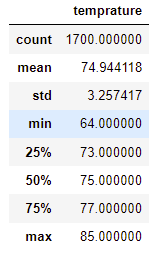
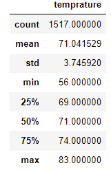
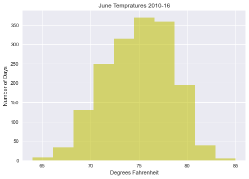
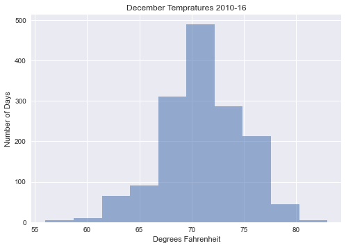

# Surfs Up Challenge

## Overview
The purpose of this project was to help our friend, international superstar W. Avy. He would like to spend the rest of his days surfing his home island of Oahu in the great state of Hawaii. To finace this relaxing retirement W. Avy wants to start an ice cream business. Selling ice cream in Hawaii can't be that hard, right? 

Unfortunately the investors he needs to get the ball moving on his tropical ice cream empire want to see some numbers and businessy stuff before they hand over a check.

W. Avy is pretty confident he can just show up, ask them all how much they like ice cream when it is warm out. Then showing them that it's hot on Oahu year round. 

He asked us to get some temprature data for the island to show the investors

### Resources 
Python 3.9.7, Jupyter Notebook, VS Code, supplied SQLite database (hawaii.sqlite)

## Results
The data we were given was temprature data from 9 different weather stations for the years 2010-2016. We were asked the show data that supports W. Avy's contention that it's nice all year. The simpliest way to do that was to grab the data for a summer month and a winter month so we chose June and December.

Here are some observations:

- June had an average temprature of 74.9 F with an inter quartile range from 73 F and 77 F. 

- December's average is only a few degrees cooler, 71.0 F. It does have a slightly larger IQR, 69 F and 74 F. 
- While the temprature averages and spread for both months were very similar December did have a significantly lower minimum Temp 56 F compaired to a minimum of 64 degrees

###
June Statistical Data: 

December Statistical Data: 

## Summary

That is all that our easygoing buddy W. Avy has asked for so good luck to him. I presonally would have wanted a more complete picture how the weather varried from month to month. 

For instance I would have wanto got grab and summerize the precipitation data. Do you like to eat ice cream while it is raining?

I would have also liked to plot gather and calculate some basic statistics (mean, min max) for each month the year. 
